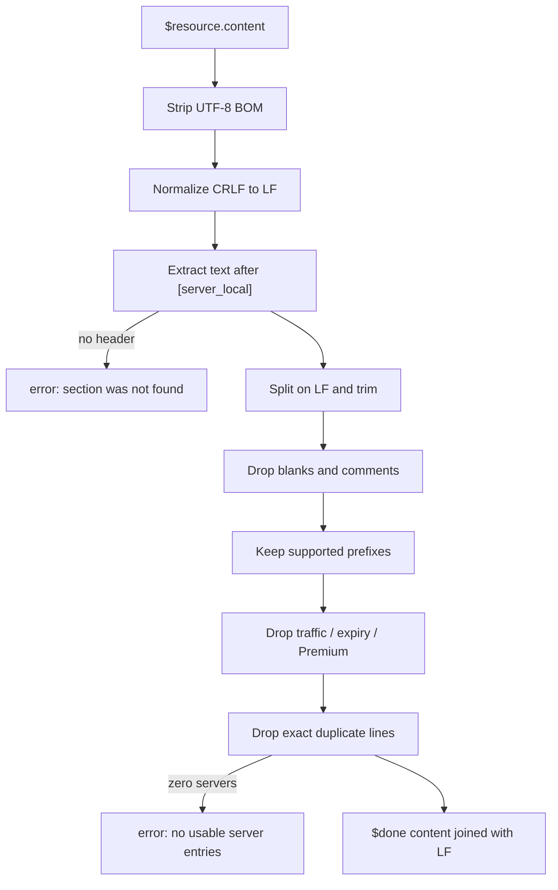

# Nexitally node parser

`nexitally-node-parser.js` turns Nexitally's managed **full Quantumult X configuration** into a server-only resource.

Nexitally's **Configuration File → Download** product is a complete profile: `[general]`, `[dns]`, `[policy]`, `[server_local]`, `[filter_remote]`, and so on. Importing that file again replaces the active profile. The parser exists so you can keep a stable local profile and refresh **only the nodes**.

If Nexitally later publishes an official Quantumult X **server-only** subscription, delete this layer and subscribe to that URL directly.

## Pipeline



The script is one pass. It does not fetch, notify, or read `$resource.link`.

## Step 1 — normalize the body

```javascript
var text = String($resource.content || "")
  .replace(/^\uFEFF/, "")
  .replace(/\r\n/g, "\n");
```

`String(...)` defends against a missing `$resource.content`. The BOM strip and CRLF rewrite are covered by [`examples/nexitally/crlf-and-bom.conf`](../examples/nexitally/crlf-and-bom.conf).

Bare `\r` (old Mac CR) is **not** rewritten. If a resource ever arrives that way, add a fixture and extend the normalizer; do not guess.

## Step 2 — extract `[server_local]`

```javascript
var match = text.match(
  /(?:^|\n)\s*\[server_local\]\s*\n([\s\S]*?)(?=\n\s*\[[^\]]+\]\s*(?:\n|$)|$)/i
);
```

| Piece | Meaning |
| --- | --- |
| `(?:^|\n)` | Header may start the file or follow a newline |
| `\s*\[server_local\]\s*` | Optional padding around the header token; **no spaces inside the brackets** |
| `\n` | A newline after the header is required |
| `([\s\S]*?)` | Non-greedy body |
| `(?=\n\s*\[[^\]]+\]\s*(?:\n|$)|$)` | Stop before the next `[section]` or at end of file |
| `i` | `[SERVER_LOCAL]` is accepted |

The capture is only the body. The header line itself is discarded.

### What this regex will not match

| Input | Result | Fixture |
| --- | --- | --- |
| No `[server_local]` at all | `section was not found` | `missing-server-local` |
| `[server_local]` with no newline after it | `section was not found` | `header-only-no-newline` |
| `[ server_local ]` (spaces inside brackets) | `section was not found` | not expected from Quantumult X |
| A later standalone `[Premium]` line | Body ends there; later servers vanish | `premium-as-section-header` |

The last row is the important caveat. `[Premium]` in a **tag** is handled by the exclude list. `[Premium]` as its **own line** is an INI section header to this extractor.

## Step 3 — line filters

Each captured line is trimmed, then kept only when every check passes.

### Comments and blanks

```javascript
if (!line || /^(?:;|#|\/\/)/.test(line)) return false;
```

Same prefixes Quantumult X uses. A comment that happens to contain `anytls=` is still dropped.

### Supported prefixes

```javascript
var supported = /^(?:anytls|shadowsocks|vmess|vless|trojan|http|socks5)\s*=/i;
```

The prefix is case-insensitive. Spaces between the name and `=` are allowed. Aliases such as `ss=` or `hy2=` are not. See `unsupported-protocol`.

### Excluded info / placeholder nodes

```javascript
var excluded = /(?:\[Premium\]|Traffic|Expire|Reset|Days Left|流量|到期|剩余|套餐)/i;
```

The match is **anywhere on the line**, not only in `tag=`. A perfectly valid-looking Shadowsocks line whose tag is `Traffic: 12 GB` is dropped. Keywords:

| Keyword | Typical source |
| --- | --- |
| `[Premium]` | Locked node placeholder in the tag |
| `Traffic` / `Expire` / `Reset` / `Days Left` | English info nodes |
| `流量` / `到期` / `剩余` / `套餐` | Chinese info nodes |

False positives are possible. A real node tagged `Reset-01` or `Remaining-A` would be dropped because `Reset` and `剩余` match. If that happens, add a narrower fixture and tighten the regex in a dedicated change; do not silently keep info nodes.

### Deduplication

```javascript
if (seen[line]) return false;
seen[line] = true;
```

The key is the **trimmed full line**. Two nodes that differ only by `tag=` are both kept. Two copies of the same line, including copies that only differed by surrounding spaces, collapse to one. Order is first-seen.

## Step 4 — `$done`

| Situation | Payload |
| --- | --- |
| Header missing / not recognized | `{ error: "Nexitally parser: [server_local] section was not found." }` |
| Header found, zero survivors | `{ error: "Nexitally parser: no usable server entries were found." }` |
| One or more survivors | `{ content: servers.join("\n") }` |

Successful `content` is server lines joined with `\n` and **no trailing extra newline beyond the last line**. Quantumult X does not require a `[server_remote]` wrapper around those lines; the resource *is* the list.

## What the parser deliberately does not do

- Read `$resource.link`, `$resource.info`, `$resource.tag`, or `$resource.user_agent`
- Convert Clash / Surge / SIP002 / V2RayN
- Honor `#in=` / `#out=` / `#rename=` hash parameters
- Rewrite `udp-relay`, `fast-open`, `tls-verification`, or SNI
- Sort or geo-group nodes
- Emit `$notify`

Those belong in a general parser or in your local `[policy]`.

## Compatibility

| Requirement | Why |
| --- | --- |
| Quantumult X with resource parsers (v1.0.8+) | `$resource` / `$done` |
| Quantumult X 1.5.6+ if the subscription uses AnyTLS | Protocol support on the client |
| A Nexitally **full configuration** URL, not an unrelated Clash file | The extractor looks for `[server_local]` |

Tested personally against Quantumult X configurations that contain AnyTLS nodes. The fixtures in `examples/nexitally/` lock the filter behavior so a later edit cannot drop Reality lines or start leaking `[filter_local]`.

## Working locally

```bash
npm test
node tests/run.js --dump examples/nexitally/typical-full-config.conf
```

The harness loads the real parser inside a `vm` sandbox with mocked `$resource` and `$done`. It does not reimplement the regexes.
