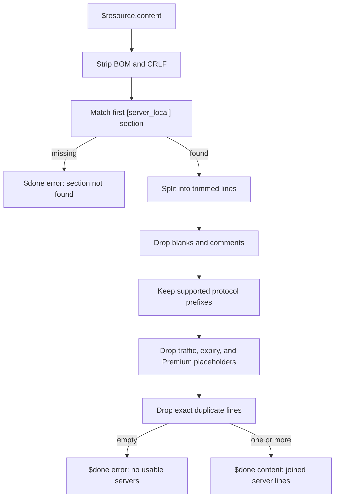

# Nexitally node parser

`nexitally-node-parser.js` is a Quantumult X resource parser for one situation:

Nexitally’s Quantumult X download is a **full configuration**, not a server-only subscription. Importing that file again overwrites `[policy]`, `[filter_remote]`, `[rewrite_remote]`, and the rest of a stable local profile. The parser keeps the download, but returns only the usable `[server_local]` lines so the URL can live under `[server_remote]`.

The script contains no subscription URL, account id, or node password.

## Pipeline



## Section extraction

The section matcher is:

```javascript
/(?:^|\n)\s*\[server_local\]\s*\n([\s\S]*?)(?=\n\s*\[[^\]]+\]\s*(?:\n|$)|$)/i
```

Behavior that matters in practice:

| Input detail | Result |
| --- | --- |
| `[server_local]` or `[SERVER_LOCAL]` | Match. The flag is case-insensitive. |
| Leading spaces before the header | Match. `\s*` allows indentation. |
| Header at the start of the file | Match. The alternative `^` covers that. |
| Header at the end of the file, no later section | Match through EOF. |
| Next INI section such as `[filter_local]` | Stops the capture. Later servers are not leaked. |
| `[ server_local ]` with inner spaces | **No match.** The header must be exactly `server_local` inside the brackets. |
| Second `[server_local]` later in the file | Ignored. Only the first match is used. |
| Header without a following newline | **No match.** The pattern requires `\n` after the header. |

The captured body is then split on `\n`.

## Line filters

A kept line must pass every check, in order:

1. **Non-empty** after `trim()`.
2. **Not a comment.** Lines that start with `;`, `#`, or `//` are dropped. Quantumult X itself treats those prefixes as comments.
3. **Supported prefix.** The line must match:

   ```javascript
   /^(?:anytls|shadowsocks|vmess|vless|trojan|http|socks5)\s*=/i
   ```

4. **Not an info / placeholder line.** The line must **not** match:

   ```javascript
   /(?:\[Premium\]|Traffic|Expire|Reset|Days Left|流量|到期|剩余|套餐)/i
   ```

5. **Not an exact duplicate** of an earlier kept line. Dedup is the full trimmed text, not the `tag=`.

Order is preserved. The first surviving line stays first.

## Supported prefixes

These prefixes follow official Quantumult X `sample.conf` names:

| Prefix | Notes |
| --- | --- |
| `anytls=` | Reason this parser exists. Needs a Quantumult X build that speaks AnyTLS. |
| `shadowsocks=` | Official name. Includes SSR-style lines that still start with `shadowsocks=` and set `ssr-protocol=`. |
| `vmess=` | Official name. |
| `vless=` | Official name. |
| `trojan=` | Official name. |
| `http=` | Official name. |
| `socks5=` | Official name. |

These do **not** pass the prefix check:

| Rejected shape | Why |
| --- | --- |
| `ss=` | Quantumult X uses `shadowsocks=`, not the short Clash-style key. |
| `shadowsocksr=` | The extra `r` breaks `shadowsocks\s*=`. Official SSR samples still use `shadowsocks=` plus `ssr-protocol=`. |
| `hysteria2=`, `tuic=`, `wireguard=` | Not in this parser’s allow-list. Add a prefix only after Quantumult X documents the line shape. |
| Clash YAML, SIP002, `vmess://` | Wrong resource type for this script. |

Whitespace around `=` is allowed (`anytls = host:443`) because the regex uses `\s*=`.

## Exclusion keywords

The exclusion regex is intentionally broad. It is a substring match on the **whole line**, case-insensitive.

Typical Nexitally-style info lines that should disappear:

```text
# Traffic: 12.34 GB / 500 GB
# Expire: 2026-12-31
# Days Left: 106
# 流量：12.34 GB
# 到期：2026-12-31
# 剩余：106 天
# 套餐：Standard
anytls=placeholder.example.com:443, password=pwd, over-tls=true, tag=[Premium] Reserved
```

Side effect worth knowing: a real node whose **tag or host** contains `Traffic`, `Expire`, `Reset`, `Days Left`, `[Premium]`, `流量`, `到期`, `剩余`, or `套餐` is also dropped. The fixtures include a node tagged `Traffic Remaining` so that behavior stays visible.

`[Premium]` is treated as a placeholder slot, not as a paid node class. If a future Nexitally config uses that token on a real server you want to keep, the exclusion list has to change.

## Errors

| Condition | `$done({ error })` message |
| --- | --- |
| No `[server_local]` section | `Nexitally parser: [server_local] section was not found.` |
| Section found, but every line was filtered out | `Nexitally parser: no usable server entries were found.` |

The parser does not validate hostnames, ports, passwords, or TLS fields. A syntactically allowed line is returned as-is. Quantumult X then accepts or rejects that server on import.

## What the parser never does

- Read or rewrite `$resource.link`
- Emit `[general]`, `[policy]`, `[filter_*]`, `[rewrite_*]`, or `[mitm]`
- Call `$notify`
- Retry the download with another User-Agent
- Resolve or fetch any URL
- Decode base64 subscriptions

Those omissions are deliberate. The script should stay small enough to audit in one screen.

## Local verification

Sanitized fixtures in [`../examples/nexitally`](../examples/nexitally) replay the pipeline without Quantumult X:

```bash
node examples/run-parser.js --only typical-full-config --verbose
```

See [`../examples/README.md`](../examples/README.md) for the full catalog.
