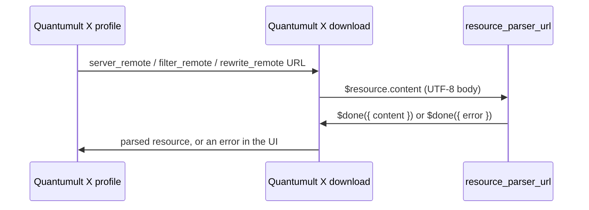

# Quantumult X resource parser API

This is a personal reference for writing parsers that Quantumult X can load through `resource_parser_url`. It is based on the official sample parser and sample configuration:

- [Official resource-parser.js](https://raw.githubusercontent.com/crossutility/Quantumult-X/master/resource-parser.js)
- [Official sample.conf](https://raw.githubusercontent.com/crossutility/Quantumult-X/master/sample.conf)
- [Official parser-helper-protocol.md](https://github.com/crossutility/Quantumult-X/blob/master/parser-helper-protocol.md) (parameterized UI, v1.5.6+)

The Nexitally script in this repository uses only `$resource.content` and `$done`. The rest of the API is documented here so a later parser can stay inside the official contract.

## Where a parser runs

Quantumult X downloads a remote resource (or reads a local snippet), then optionally runs one JavaScript parser against that body.



Important constraints from the official sample:

- HTTP request APIs and persistent storage are **not** available in a resource parser.
- The parser must finish by calling `$done` exactly once.
- `$notify(title, subtitle, message)` is available, but this repository does not use it.

A parser is therefore a local transform. It must not fetch the subscription itself, and it should not embed a private URL.

## Installing the parser URL

In `[general]`:

```ini
resource_parser_url = https://raw.githubusercontent.com/sapphireran/quanx-resource-parsers/main/nexitally-node-parser.js
```

jsDelivr is an equivalent public CDN front for the same file:

```ini
resource_parser_url = https://cdn.jsdelivr.net/gh/sapphireran/quanx-resource-parsers@main/nexitally-node-parser.js
```

Then enable the parser on a specific resource with `opt-parser=true`:

```ini
[server_remote]
<YOUR_PRIVATE_RESOURCE_URL>, tag=Nexitally, opt-parser=true, update-interval=21600, enabled=true
```

`opt-parser=true` is the official sample.conf pattern for “run the configured resource parser on this one resource.” Resources without that flag stay untouched.

## Input: `$resource`

| Field | Since | Meaning |
| --- | --- | --- |
| `$resource.content` | v1.0.8-build253 | UTF-8 body of the downloaded resource |
| `$resource.link` | v1.0.8-build253 | Original URL, or a local path for a snippet |
| `$resource.info` | v1.0.10-build277 | `subscription-userinfo` response header, server resources only |
| `$resource.tag` | v1.0.10-build277 | The `tag=` value from the resource line |
| `$resource.user_agent` | v1.5.6-build921 | UA used for the current download. Empty on the first attempt; equals the retry UA after a retry |

The Nexitally parser reads only `$resource.content`. It never logs `$resource.link`, because that field is the private subscription URL.

Normalize the body before matching:

1. Coerce with `String($resource.content || "")`.
2. Strip a leading UTF-8 BOM (`\uFEFF`).
3. Convert `\r\n` to `\n`.

Those three steps are what the current parser does. Windows-exported configs and some dashboards otherwise fail the `[server_local]` regex.

## Output: `$done`

| Shape | Meaning |
| --- | --- |
| `$done({ content: "..." })` | Success. For a server resource, `content` must be Quantumult X server lines, one per line. |
| `$done({ error: "..." })` | Failure. Quantumult X shows the string in the resource UI. |
| `$done({ retry: { user_agent: "..." } })` | v1.5.6+. Ask native to re-download once with that UA, then parse again. |

Official retry rules:

- At most one retry per resource.
- A non-empty `$resource.user_agent` means the script is already in a retry; returning `retry` again has no effect.
- Older Quantumult X builds ignore `retry`. Pair it with `content` or `error` as a fallback.
- On new builds, `retry` takes priority over `content` / `error`.

This repository does not retry. Nexitally’s managed Quantumult X configuration is already in Quantumult X syntax; a UA mismatch is not the failure mode.

## What a server parser must return

`[server_remote]` expects the same line shape as `[server_local]`. The official sample uses prefixes such as:

```text
shadowsocks=example.com:80, method=chacha20, password=pwd, tag=Tag-A
anytls=example.com:443, password=pwd, over-tls=true, tls-host=apple.com, udp-relay=true, tag=anytls-standard-tls-01
```

Do **not** wrap the result in an INI section header. Returning:

```ini
[server_local]
anytls=...
```

is wrong for a parsed server resource. Return only the server lines.

Do **not** return Clash YAML, SIP002 URIs, or a full Quantumult X profile. Those belong in a different kind of parser (for example a general subscription converter). This repository’s Nexitally script is the opposite: the input is already a full Quantumult X profile, and the output is the extracted server list.

## Parameterized UI (`$parser`)

Quantumult X v1.5.6+ can render a parameter editor from `$parser.hashSchema`, `$parser.hashToUI`, and `$parser.uiToHash`. That protocol is documented upstream in `parser-helper-protocol.md`.

The Nexitally parser does not declare a hash schema. The resource URL is used as-is. Hash parameters such as `#in=香港` belong to general-purpose converters, not to this script.

## JavaScript dialect

Write parsers as conservative ES5:

- `var`, `function`, `RegExp`, `Object` maps
- no `const` / `let` requirement, but they are usually fine
- no optional chaining, nullish coalescing, or ESM `import`
- no Node APIs (`fs`, `http`, `Buffer`)

Quantumult X evaluates the script in its own runtime. The local example runner in this repository uses Node’s `vm` module only as a stand-in for that runtime. Passing Node tests is necessary but not sufficient; a final check still happens inside Quantumult X after a resource refresh.

## What this API is not

A resource parser is not:

- a rewrite script (`$request` / `$response`)
- a task script (`$task.fetch`)
- an HTTP backend
- a place to store credentials

If a transform needs network I/O or secrets, it does not belong in `resource_parser_url`.
