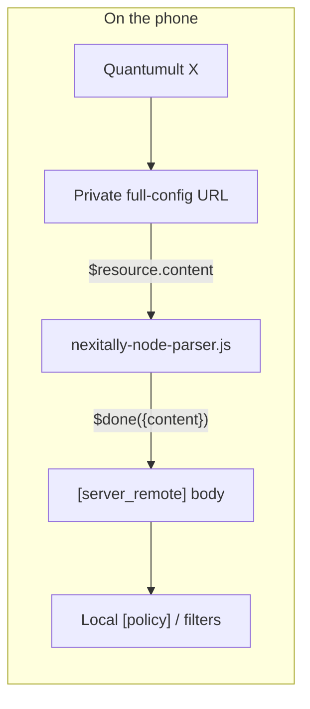

# Why a server resource

Nexitally’s Quantumult X download is a **complete profile**: `[general]`, `[dns]`, `[policy]`, `[server_local]`, filters, rewrites, MITM. Importing that file is the fastest way to get nodes *and* the fastest way to wipe a locally tuned policy tree.

The stable personal profile should own:

- `[general]` (including `resource_parser_url`);
- `[policy]` groups, icons, regex candidates;
- `[filter_local]` / `[filter_remote]`;
- `[rewrite_local]` / `[rewrite_remote]`;
- `[mitm]` (usually off).

The provider should own **only the node list**, refreshed on an interval.

Quantumult X fetches the private URL itself. The parser never sees the network. It receives the response body, cuts `[server_local]`, and returns newline-joined server lines. Those lines become the Nexitally resource’s servers. Local policy continues to select among them with `resource-tag-regex` / `server-tag-regex`.

If Nexitally later publishes an official **server-only** Quantumult X resource, delete `opt-parser=true` and this script. The local `[policy]` can stay.
