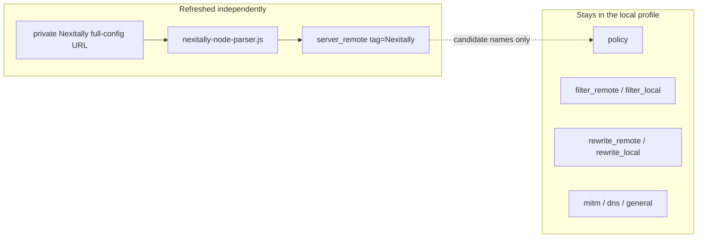

# Personal Quantumult X workflow

Goal: refresh Nexitally nodes without replacing the rest of a local Quantumult X profile.

This is a personal workflow. Provider dashboards change. If Nexitally later publishes an official Quantumult X **server-only** subscription, delete this parser layer and point `[server_remote]` at that official URL.

## Why a parser is required

Nexitally’s Quantumult X export is a complete configuration:

- `[general]`, `[dns]`, `[policy]`
- remote filter / rewrite lists
- a `[server_local]` block that holds the actual nodes
- often a few comment lines for traffic and expiry

Quantumult X’s **Configuration File → Download** (or an equivalent “import this URL as the whole profile”) replaces the active file. That is convenient the first time and destructive after a local profile has diverged: custom policy groups, filter lists, MitM hostnames, and device-specific bits disappear.

A resource parser turns the same download into a `[server_remote]` source. Quantumult X still fetches the private URL; the parser throws away everything except usable server lines.



Policy groups that select nodes by `resource-tag-regex` or `server-tag-regex` keep working, because the imported servers still carry their `tag=` values. Groups that hard-code node names need those names to remain stable on the provider side.

## One-time setup

1. Build or import a **stable** local profile. Confirm policy, filters, and rewrites are the ones you want to keep.
2. In Nexitally’s dashboard, copy the **Quantumult X full-configuration** URL. Leave it on the device. Do not paste it into this repository, a gist, chat, or screenshot.
3. Add the parser to `[general]`:

   ```ini
   resource_parser_url = https://raw.githubusercontent.com/sapphireran/quanx-resource-parsers/main/nexitally-node-parser.js
   ```

   Pinning `@main` on jsDelivr is the CDN equivalent:

   ```ini
   resource_parser_url = https://cdn.jsdelivr.net/gh/sapphireran/quanx-resource-parsers@main/nexitally-node-parser.js
   ```

4. Add the private URL under `[server_remote]`, with the parser enabled:

   ```ini
   [server_remote]
   <YOUR_PRIVATE_NEXITALLY_QUANTUMULT_X_URL>, tag=Nexitally, opt-parser=true, update-interval=21600, enabled=true
   ```

5. Optional: if an older Nexitally import left nodes in `[server_local]`, delete those local copies after the remote resource succeeds. Otherwise you will see duplicates in the node list.
6. Refresh **Server Resources → Nexitally** (or the tag you chose).

`update-interval=21600` is six hours. Use a negative interval to disable automatic refresh, matching official `sample.conf` comments.

## What a successful refresh looks like

- The Nexitally resource shows a node count, not a parser error.
- Node names match the provider’s `[server_local]` tags, minus Premium placeholders and traffic comments.
- `[policy]` still lists your groups. New node names appear as candidates when the group uses a resource-tag or server-tag regex.
- Filter and rewrite remotes are unchanged.

If the resource shows `Nexitally parser: [server_local] section was not found.`, Quantumult X downloaded something that is not a full Quantumult X configuration. See [troubleshooting](troubleshooting.md).

## Keeping the private URL private

The URL is an account credential. Treat it like a password:

- Store it only in the local Quantumult X configuration (or iCloud Quantumult X folder if you already sync that way).
- Never commit it, never put it in an issue, and never encode it inside a parser.
- When sharing a profile snippet, replace the URL with `<YOUR_PRIVATE_NEXITALLY_QUANTUMULT_X_URL>`.

The parser script is public; the resource it parses is not. That split is the whole point of `resource_parser_url`.

## Updating the parser itself

Quantumult X caches `resource_parser_url`. After a script change on `main`:

1. Confirm the commit is on `main` (raw GitHub or jsDelivr).
2. In Quantumult X, refresh the parser resource or toggle `resource_parser_url`.
3. Refresh the Nexitally server resource so the new script actually runs.

jsDelivr can lag behind GitHub raw by a few minutes. When debugging a parser change, prefer the `raw.githubusercontent.com` URL.

## When to stop using this parser

Remove `opt-parser=true` and this script when any of these become true:

- Nexitally offers a native Quantumult X server subscription (server lines only).
- You are willing to let the official full configuration replace the local profile on every update.
- The downloaded body is no longer a Quantumult X INI file (for example it becomes Clash YAML). In that case this parser cannot help; a different converter would be required.
